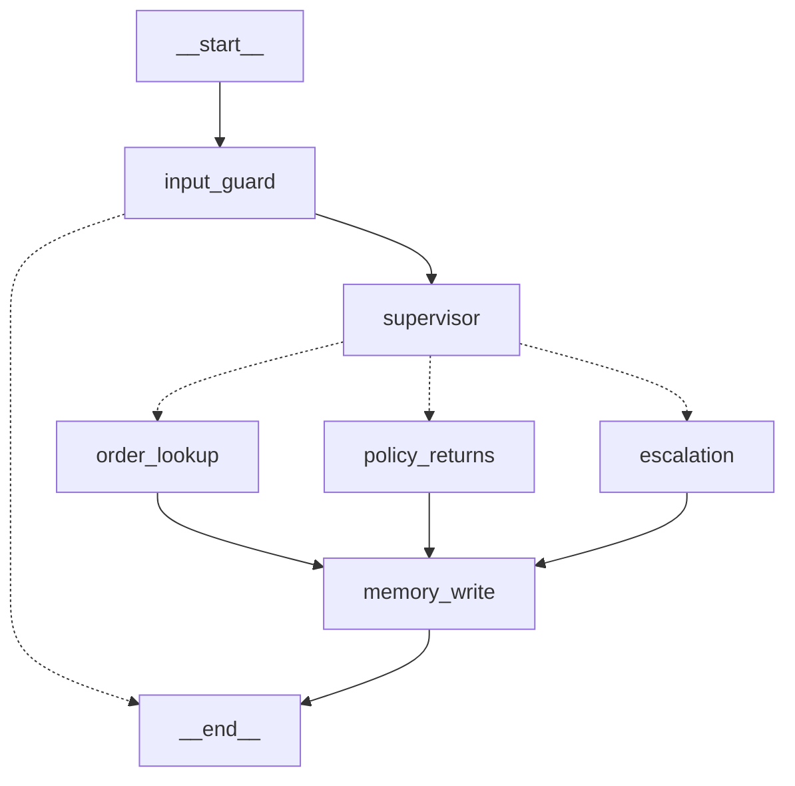

# E-Commerce Customer Support Agent

CSAI 422 Capstone Project — A multi-agent AI customer support system built with LangGraph.

## Architecture

```
Customer Message
    │
input_guard  ← Pillar 3: injection / off-topic / PII masking
    │
┌──[blocked]──► END
│
[ok]
    │
supervisor   ← Pillar 2: LLM classifier + reads customer memory
    │
┌───┼───────────┐
│   │           │
order_lookup  policy_returns  escalation
              (Agentic RAG)   (LLM summary)
└───┴───────────┘
    │
memory_write ← Pillar 2: persists interaction to long-term store
    │
END
```

**Graph visualization** (generated via `graph.get_graph().draw_mermaid()`):



## Quick Start

```bash
# 1. Enter the project directory
cd ecommerce-support-agent

# 2. Create a virtual environment
python3.13 -m venv .venv
source .venv/bin/activate

# 3. Install dependencies
pip install -e .

# 4. Copy and fill in environment variables
cp .env.example .env
# Edit .env — add your OPENAI_API_KEY

# 5. Generate synthetic order data
python data/orders/generate_orders.py

# 6. Ingest documents into the vector store
python -m src.rag.ingest

# 7. Run the full system smoke test
python -m src.graph.build_graph

# 8. Run the Streamlit dashboard
streamlit run app.py

# 9. (Optional) Run RAGAS evaluation
python -m src.eval.ragas_eval
```

## Project Status

- [x] **Milestone 0**: Runnable graph with routing, state persistence, and mock data
- [x] **Pillar 1**: Advanced RAG — hybrid + cross-encoder rerank, RAGAS eval (avg 0.86)
- [x] **Pillar 2**: Multi-agent + Memory — LangGraph Store, LLM supervisor, LLM escalation
- [x] **Pillar 3**: Guardrails — prompt injection block, PII masking, off-topic redirect
- [x] **Pillar 4**: Observability & Evaluation — Streamlit dashboard, RAGAS metrics display

## Tech Stack

| Component | Tool |
|-----------|------|
| Orchestration | LangGraph + LangChain |
| LLM | OpenAI gpt-4o-mini |
| Embeddings | text-embedding-3-small |
| Vector Store | Chroma (persistent) |
| Short-term memory | SqliteSaver (per thread) |
| Long-term memory | LangGraph InMemoryStore (per customer) |
| Guardrails | Rule-based (regex, keyword) |
| Eval | RAGAS-style LLM-as-judge |
| Dashboard | Streamlit |

## Environment

- Python 3.11+
- All dependencies listed in `pyproject.toml`
