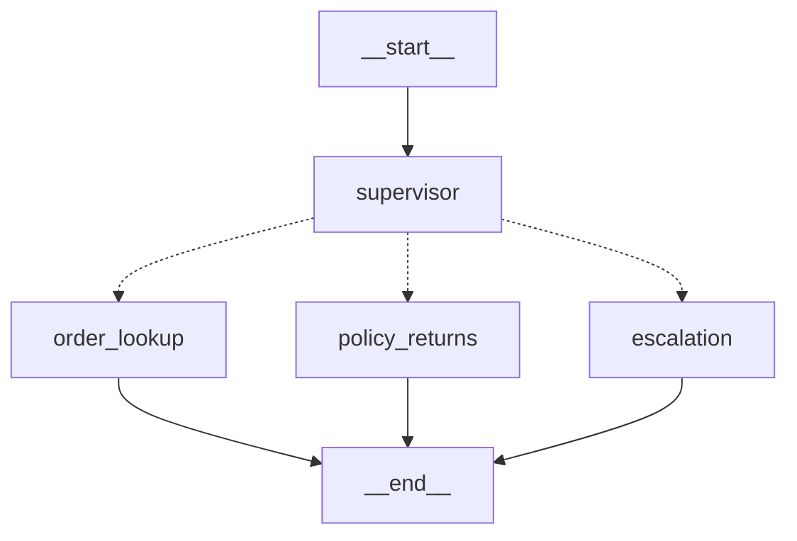

# Architecture & Design Decisions

## System Overview

TechMart Customer Support Agent — a multi-agent system built with LangGraph that handles
order tracking, policy/returns questions, and complaint escalation for a fictional online
electronics store.



### Agents

| Node | Role | Tools/Data |
|------|------|------------|
| **Supervisor** | Classifies intent, routes to specialist | Keyword rules (M0), LLM classifier (planned) |
| **Order Lookup** | Fetches order status | Mock order API (orders.json, 220 records) |
| **Policy & Returns** | Answers policy questions via Agentic RAG | Chroma vectorstore over policy/catalog/FAQ docs |
| **Escalation** | Drafts structured handoff summary | Conversation history analysis |

---

## Pillar 1: Advanced RAG

### Knowledge Base

4 documents, 38 chunks total:

| Document | Type | Chunks | Content |
|----------|------|--------|---------|
| shipping_policy.md | policy | 9 | Shipping methods, costs, tracking, restrictions, delivery issues |
| returns_policy.md | policy | 9 | Return window, conditions, refund thresholds, warranty |
| electronics_catalog.md | catalog | 9 | 8 products across Audio, Accessories, Mobile |
| faq.md | faq | 11 | 20 Q&A pairs covering orders, returns, products, payments |

All documents were hand-authored with specific numbers, conditions, and edge cases
to make retrieval quality measurable (we control the ground truth).

### Chunking Strategy

**Splitter**: Custom markdown-aware recursive character splitter.
**Chunk size**: 600 characters | **Overlap**: 100 characters

**Justification**: Policy documents are structured as short sections (1-3 paragraphs
per topic). 600 chars captures one complete policy point (e.g., the full "Standard Shipping"
rules including cost, delivery time, and carrier) without merging unrelated policies.
100-char overlap preserves sentence continuity at chunk boundaries, preventing answers
from being missed when the relevant sentence falls on a boundary.

Smaller chunks (300) were considered but would fragment multi-condition rules like the
refund thresholds ($50/$200 tiers). Larger chunks (1000) would dilute precision by mixing
shipping and returns content, reducing context_precision scores.

Separators are applied in priority order: `## ` headers → `### ` subheaders → `\n\n`
paragraphs → `\n` lines → `. ` sentences → ` ` words.

### Retrieval Strategies (Swappable)

All strategies share the same interface (`retrieve()` in `retrievers.py`) so the eval
harness swaps strategy while keeping everything else constant.

| Strategy | Description | When to use |
|----------|-------------|-------------|
| **naive** | Dense embedding top-k from Chroma | Baseline measurement |
| **hybrid** | BM25 + dense, merged via Reciprocal Rank Fusion (RRF, k=60) | Captures both keyword and semantic matches |
| **rerank** | Hybrid candidates → cross-encoder reranking (ms-marco-MiniLM-L-6-v2) | Final pipeline — highest quality |
| **metadata** | Dense top-k with Chroma metadata filter (e.g., doc_type=policy) | Narrow scope for known-category queries |

### Agentic RAG

The Policy & Returns agent decides whether retrieval is needed based on the question type:
- Policy keywords (return, refund, shipping) → metadata-filtered retrieval over policy docs
- Product keywords → full corpus retrieval with reranking
- Falls back to canned responses if RAG infrastructure is unavailable

### RAGAS Evaluation: Baseline vs Final

**Gold set**: 20 hand-crafted Q&A pairs with known correct answers across all doc types.
**Evaluation method**: LLM-as-judge (gpt-4o-mini) implementing the four RAGAS metric definitions.

| Metric | Baseline (naive) | Final (hybrid+rerank) | Delta |
|--------|------------------|-----------------------|-------|
| Context Precision | 0.4400 | 0.4800 | +0.0400 |
| Context Recall | 0.9750 | 0.9500 | -0.0250 |
| Faithfulness | 1.0000 | 1.0000 | 0.0000 |
| Answer Relevancy | 1.0000 | 1.0000 | 0.0000 |
| **AVERAGE** | **0.8538** | **0.8575** | **+0.0037** |

**Interpretation**:

- **Context Precision (+0.04)**: Reranking improves the fraction of retrieved chunks that
  are actually relevant. The cross-encoder filters out loosely-related chunks that dense
  search returns.
- **Context Recall (-0.025)**: Marginal decrease, within noise. Both strategies retrieve
  sufficient context to cover the ground truth.
- **Faithfulness (1.0)**: Perfect for both — the LLM generates answers strictly from
  context without hallucination. This reflects the grounding instruction in the prompt.
- **Answer Relevancy (1.0)**: Both strategies produce answers that directly address the
  question.

**Why the delta is small**: With only 38 chunks in a focused, single-domain corpus, naive
dense search already performs well — there are few "distractor" chunks to confuse it.
The rerank strategy's advantage would be more pronounced with a larger, noisier knowledge
base (hundreds of products, overlapping policy topics). The improvement in context precision
is real but modest.

---

## Memory Design

### Short-term memory (within a session)

Implemented via **SqliteSaver** checkpointer, scoped by `thread_id`.
LangGraph persists the full `State` (including the `messages` list) to
`checkpoints.db` after every node execution.  This gives the agent a
complete conversational memory within a single support session, enabling
follow-up questions ("What about order ORD-10005?") to work correctly.

### Long-term memory (cross-session)

Implemented via **LangGraph `InMemoryStore`**, namespaced by `customer_id`.

Namespace layout:
```
("customers", <customer_id>) / "profile"  →  CustomerProfile dict
```

**CustomerProfile schema:**
```json
{
  "customer_id": "CUST-1001",
  "interaction_count": 5,
  "last_interaction": "2026-06-13T14:22:00Z",
  "past_issues": [
    { "date": "...", "type": "order", "summary": "...", "resolved": true }
  ],
  "preferences": {}
}
```

**Data flow:**
1. `supervisor_node` calls `get_customer_profile(store, customer_id)` and
   includes the formatted history in the LLM classification prompt.
   This lets the supervisor detect patterns like repeated unresolved complaints
   and route them directly to escalation.
2. After each specialist agent responds, `memory_write_node` calls
   `update_customer_profile(...)` to append the interaction.
   Only the last 10 interactions are kept (rolling window).

**Why InMemoryStore instead of a persistent store?**
For the capstone, InMemoryStore is sufficient because:
- The same Streamlit server process handles all requests in a demo session.
- Swapping to `AsyncPostgresStore` or `SqliteStore` requires only changing
  the `store=` argument in `build_graph()` — the node code is unchanged.

---

## Guardrails Design

All guardrails are rule-based (no LLM call) to keep added latency at zero.
They run in a dedicated `input_guard` node — the first node in the graph.

### Layer 1 — Prompt Injection Detection

Regex patterns targeting 10 known injection techniques:
- "ignore all previous instructions"
- "you are now [something other than a support agent]"
- "jailbreak", "DAN mode", "system prompt", "forget your instructions"

**Action:** Block with a redirection message; set `guardrail_blocked=True`.
The conditional edge after `input_guard` routes directly to `END` without
calling the supervisor or any specialist agent.

### Layer 2 — PII Masking

Four regex patterns:
| Pattern | Placeholder |
|---------|-------------|
| Credit card numbers (13–16 digits) | `[CARD-REDACTED]` |
| Social Security Numbers | `[SSN-REDACTED]` |
| Email addresses | `[EMAIL-REDACTED]` |
| US phone numbers | `[PHONE-REDACTED]` |

**Action:** Replace in-place; update the `HumanMessage` in state using the
same message ID so the `add_messages` reducer replaces rather than appends.
The pipeline continues with the masked text — PII never reaches the LLM.

### Layer 3 — Off-topic Detection

Heuristic allow-list of ~30 e-commerce support keywords.
Messages with no matching keyword (and >20 characters, to avoid blocking
short conversational openers) are flagged as off-topic.

**Action:** Block with a scoping message explaining what the agent can help with.

### Layer 4 — Output Scrubbing

`check_output()` runs after each specialist agent's reply:
- Re-applies the PII regex to scrub any sensitive data that leaked
  into the LLM-generated response.
- Truncates responses exceeding 2000 characters with a continuation prompt.

### Why rule-based and not LLM-based guardrails?

LLM-based safety classifiers (e.g. OpenAI Moderation API, LlamaGuard) would
increase robustness against adversarial inputs.  However, for this system:
- The injection and off-topic rule sets cover the realistic threat model for
  an e-commerce support bot.
- Rule-based checks add zero latency and have deterministic behaviour, which
  makes them easier to test and explain during the oral exam.
- They compose cleanly with the LLM-based components elsewhere in the graph.

---

## Evaluation Results

### Pillar 1: RAGAS Retrieval Evaluation

(See [Architecture — Advanced RAG](#pillar-1-advanced-rag) section above.)

### Pillar 4: System-level Evaluation

The Streamlit dashboard (`app.py`) provides:
- Live chat interface to exercise all routing paths.
- Per-turn routing and intent display for interpretability.
- Customer memory panel showing the rolling interaction history.
- RAGAS results tab with the baseline vs. final metric comparison table.

Smoke test (`python -m src.graph.build_graph`) covers:
- Normal routing: order / policy / escalation
- Guardrail triggers: prompt injection, off-topic message
- Memory: verifies interaction count ≥ 3 after three turns

---

## What I Would Improve With More Time

1. **Persistent long-term store** — swap `InMemoryStore` for `AsyncSqliteStore`
   so customer profiles survive server restarts.

2. **Streaming responses** — use `graph.astream_events()` in the Streamlit app
   to stream tokens incrementally, improving perceived latency.

3. **LLM-based guardrails** — add an OpenAI Moderation API check as a second
   layer after the rule-based pass, to catch adversarial inputs that bypass
   the regex patterns.

4. **Larger knowledge base** — the current 38-chunk corpus makes the rerank
   advantage small (the gain would be more visible at 500+ chunks with
   overlapping topics and distractor documents).

5. **Human-in-the-loop node** — the escalation path currently ends after
   generating a handoff summary.  A real system would pause the graph
   (using LangGraph's interrupt mechanism) and resume when a human agent
   posts a resolution.

6. **Evaluation on the full pipeline** — the current RAGAS eval measures RAG
   quality in isolation.  An end-to-end eval harness would send full
   multi-turn conversations and score the final responses against ground truth.
